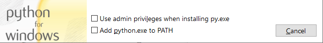
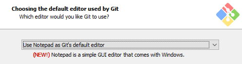
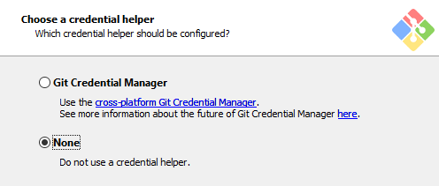
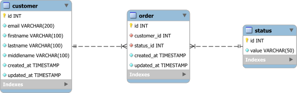
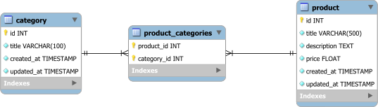
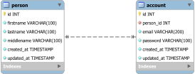
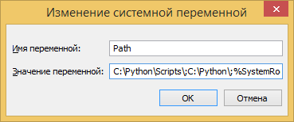
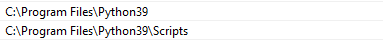
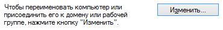
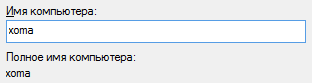

# Python3. Памятка для начинающих

Кирилл Версетти

Обновлено 03.05.2021


- [Python3. Памятка для начинающих](#python3-памятка-для-начинающих)
  - [Установка и настройка рабочего окружения](#установка-и-настройка-рабочего-окружения)
    - [Какой софт минимально необходим?](#какой-софт-минимально-необходим)
    - [Как установить интерпретатор Python в Linux?](#как-установить-интерпретатор-python-в-linux)
    - [Как установить интерпретатор Python в MacOS?](#как-установить-интерпретатор-python-в-macos)
    - [Как установить интерпретатор Python в Windows?](#как-установить-интерпретатор-python-в-windows)
    - [Как установить Git в Linux?](#как-установить-git-в-linux)
    - [Как установить Git в MacOS?](#как-установить-git-в-macos)
    - [Как установить Git в Windows?](#как-установить-git-в-windows)
    - [Как открыть терминал в вашей ОС?](#как-открыть-терминал-в-вашей-ос)
    - [Как выбрать редактор кода (IDE)?](#как-выбрать-редактор-кода-ide)
  - [Введение](#введение)
    - [Переменные и типы данных](#переменные-и-типы-данных)
    - [Приоритет операторов](#приоритет-операторов)
    - [Таблицы истинности логических операторов](#таблицы-истинности-логических-операторов)
    - [Методы строк](#методы-строк)
    - [Методы списков](#методы-списков)
    - [Методы множеств](#методы-множеств)
    - [Методы словарей](#методы-словарей)
    - [Функции при итерациях](#функции-при-итерациях)
    - [Функция обратного вызова](#функция-обратного-вызова)
  - [Файловый ввод и вывод](#файловый-ввод-и-вывод)
    - [Режимы открытия файла](#режимы-открытия-файла)
    - [Методы для работы с файлами](#методы-для-работы-с-файлами)
  - [Введение в базы данных](#введение-в-базы-данных)
    - [Реляционные базы данных](#реляционные-базы-данных)
    - [Зачем нужен первичный ключ?](#зачем-нужен-первичный-ключ)
    - [Зачем нужен внешний ключ?](#зачем-нужен-внешний-ключ)
    - [SQL - Structured Query Language](#sql---structured-query-language)
    - [Python Database API](#python-database-api)
    - [Алгоритм взаимодействия с БД](#алгоритм-взаимодействия-с-бд)
  - [Виртуальное окружение](#виртуальное-окружение)
    - [Какой модуль использовать?](#какой-модуль-использовать)
    - [Как создать виртуальное окружение?](#как-создать-виртуальное-окружение)
    - [Как активировать виртуальное окружение?](#как-активировать-виртуальное-окружение)
    - [Как деактивировать виртуальное окружение?](#как-деактивировать-виртуальное-окружение)
    - [Пара слов о Pipenv](#пара-слов-о-pipenv)
  - [Пользовательские директории](#пользовательские-директории)
  - [Приложение 1. PEP-8 коротко и по-русски](#приложение-1-pep-8-коротко-и-по-русски)
  - [Приложение 2. Заметки для пользователей Windows](#приложение-2-заметки-для-пользователей-windows)
    - [Как задать или настроить переменную окружения PATH в Windows?](#как-задать-или-настроить-переменную-окружения-path-в-windows)
    - [Как изменить имя компьютера в Windows?](#как-изменить-имя-компьютера-в-windows)
    - [Как переименовать пользователя в Windows?](#как-переименовать-пользователя-в-windows)


## Установка и настройка рабочего окружения

### Какой софт минимально необходим?

1. Интерпретатор **Python** \>= 3.7 с модулями **pip** и **venv**
   \[
      [Linux][install-python-linux] | [MacOS][install-python-mac] | [Windows][install-python-win]
   \]

2. Распределенная система контроля версий **Git**
   \[
      [Linux][install-git-linux] | [MacOS][install-git-mac] | [Windows][install-git-win]
   \]

3. Терминал (Командная строка)
   \[
      [Linux][how-open-terminal] | [MacOS][how-open-terminal] | [Windows][how-open-terminal]
   \]

4. Редактор кода
   \[
      [Linux][how-choose-ide] | [MacOS][how-choose-ide] | [Windows][how-choose-ide]
   \]

### Как установить интерпретатор Python в Linux?

В операционных системах семейства Linux, интерпретатор Python, как правило, уже установлен.
Однако, в репозитории может быть доступна более свежая версия,
либо необходимые пакеты не установлены, поэтому повторим установку еще раз:

1. Debian GNU/Linux и Debian based (например, Ubuntu, Linux Mint, Elementary OS):

   ```
   # apt update && apt install python3 python3-pip python3-venv
   ```

2. CentOS 8 (репозиторий appstream):
   
   ```
   # dnf install python38
   # alternatives --set python3 /usr/bin/python3.8
   ```

3. CentOS 7:
   
   ```
   # yum install python3
   ```

4. Manjaro 20.1: все необходимые пакеты уже установлены.

5. Fedora 33: все необходимые пакеты уже установлены.

Проверяем, вводим команду и если на экране отобразилась версия интерпретатора,
то все установлено верно:

```
$ python3 -V
```

### Как установить интерпретатор Python в MacOS?

С [официального сайта](https://www.python.org/downloads/mac-osx/)
скачать установщик для последнего стабильного релиза.

Проверяем, [открываем терминал][how-open-terminal],
вводим команду и если на экране отобразилась версия интерпретатора, то все установлено верно:

```
$ python3 -V
```

### Как установить интерпретатор Python в Windows?

1. С [официального сайта](https://www.python.org/downloads/windows/)
   скачать установщик для последнего стабильного релиза.

2. На первой странице установщика **не забыть поставить галочку** "Add python.exe to PATH":
   
   

3. **Проверить**, чтобы в [имени компьютера][how-change-pc-name-win]
   и [имени пользователя][how-change-username-win] не было кириллицы,
   допустима только латиница.

4. Проверяем, [открываем командную строку][how-open-terminal],
   вводим команду и если на экране отобразилась версия интерпретатора,
   то все установлено верно:

```
C:\> python -V
```

Если при попытке запустить интерпретатор из командной строки вы получили ошибку
"*python не является внутренней или внешней командой, исполняемой программой или пакетным файлом.*",
то требуется вручную изменить [переменную окружения **PATH**][how-set-path-envvar-win]:

1. В [командной строке][how-open-terminal] найти директорию установки интерпретатора
   (в примере это **C:\python\Scripts**):
   
   ```
   C:\Users\User> cd \
   C:\> dir pip.exe /s
    Том в устройстве C не имеет метки.
    Серийный номер тома: 161A-9CAB

    Содержимое папки C:\python\Scripts

   26.04.2024  21:41           108 429 pip.exe
                  1 файлов        108 429 байт

      Всего файлов:
                  1 файлов        108 429 байт
                  0 папок  51 621 982 208 байт свободно
   ```

2. В переменную **PATH** добавить два пути **C:\\python** и **C:\\python\\Scripts**

### Как установить Git в Linux?

1. Debian GNU/Linux и Debian based (например, Ubuntu, Linux Mint, Elementary OS):
   ```
   apt update && apt install git
   ```

1. CentOS 8, Fedora \>=22:
   ```
   dnf install git
   ```

1. CentOS 7, Fedora \<22:
   ```
   yum install git
   ```

1. Arch Linux, Manjaro:
   ```
   pacman -Sy git
   ```

Проверяем, вводим команду и если на экране отобразилась версия программы,
то все установлено верно:

```
git -v
```

### Как установить Git в MacOS?

[На официальном сайте](https://git-scm.com/download/mac)
выбрать один из подходящих способов установки:
homebrew, xcode или установщик; самый простой - скачать установщик.

Проверяем, [открываем терминал][how-open-terminal],
вводим команду и если на экране отобразилась версия программы, то все установлено верно:

```
git -v
```


### Как установить Git в Windows?

1. С [официального сайта](https://git-scm.com/download/win)
   скачать установщик для последнего стабильного релиза.

2. Запустить установщик и изменить значения на указанных шагах:

   1. **Choosing the default editor used by Git** позволяет задать редактор по-умолчанию,
      который будет использован, например, когда вы забыли указать сообщение для коммита.
      Для новичков рекомендуется выбрать стандартный блокнот -
      "Use Notepad as Git's default editor".
      Для продвинутых пользователей, умеющих работать в Vim,
      можно оставить значение по-умолчанию:
   
      

   2. **Choose a credential helper** отвечает за настройку хранилища учетных данных.
      Если вы используйте протокол HTTP для доступа к удаленным репозиториям,
      то при каждом подключении необходимо указывать логин и пароль.
      Git использует такое поведение по-умолчанию - выбираем **None**:
   
      

      Позже вы сможете самостоятельно настроить это поведение удобным и безопасным для вас способом.

Проверяем, [открываем командную строку][how-open-terminal],
вводим команду и если на экране отобразилась версия программы, то все установлено верно:

```
C:\> git --version
```

### Как открыть терминал в вашей ОС?

1. Linux – вы точно знаете, где он находится =)

2. MacOS – в строке поиска **Spotlight** введите слово Терминал и нажмите **Enter**

3. MS Windows – сочетанием клавиш **Win+R** открыть окно "Выполнить",
   ввести команду **cmd** и нажать **Enter**

### Как выбрать редактор кода (IDE)?

Если вы новичок и хотите выучить новый язык программирования,
то отдать предпочтение блокноту с подсветкой синтаксиса, но только не IDLE.

Почему именно такой выбор?
Чем проще редактор, тем проще им пользоваться,
у вас не будет соблазна нажать "магическую" кнопку,
вы все будете делать самостоятельно вручную шаг за шагом.
Хороший разработчик знает "как оно работает внутри"
и в случае возникновения ошибок или отсутствия привычного инструмента, не окажется в тупике.

Автодополнение зло - когда вы в коде прописываете каждое слово по буквам,
у вас работает, как минимум, два вида памяти: зрительная и моторная.
А если вы будете голосом проговаривать, что пишите, то сработает и слуховая память.
Автодополнение допускает писать код "на глазок" - кажется оно так выглядело,
выберу похожее из списка.

Нужно учиться искать ошибки в коде без чьей либо помощи - вы обязаны уметь читать трейсбек,
понимать, в каком файле и в какой строке произошла ошибка,
что это за ошибка: синтаксическая, арифметическая, логическая и т.д.
Зачастую среда может подсветить место в коде, которое не является ошибочным,
но новичок этого понять не может.

Нужно уметь работать с утилитами разработчика в терминале - так как терминал
это один из основных инструментов питониста и тот,
кто пытается доказать обратное, скорее претендует на звание "программиста-домохозяйки",
чем специалиста. Здесь ситуация такая же, как и с "магической" кнопкой,
удобно нажать на зеленую стрелочку для запуска программы,
но в боевых условиях зеленых стрелочек нет и что-то может пойти не так.
Классический вопрос от автора: "Что вы будете делать, если перед вами голая консоль?".

Вот некоторые популярные кроссплатформенные редакторы,
которые из коробки достаточно простые:

* [Visual Studio Code](https://code.visualstudio.com/) -
  модный молодежный редактор от Microsoft с кучей плагинов.
  В умелых руках мощно превратить в мощную IDE.
* [Sublime Text](https://www.sublimetext.com) - субъективно,
  самый лучший выбор, не требователен к ресурсам,
  только не забыть настроить трансляцию табуляции в четыре пробела.

Когда вы запомните синтаксис языка, сможете без проблем прочитать любую ошибку,
а терминал не будет вызывать у вас паники, можно перейти на профессиональную IDE,
например, [PyCharm](https://www.jetbrains.com/ru-ru/pycharm/).
Профессиональный инструмент имеет ряд преимуществ перед блокнотом:

* скорость работы - за счет автодополнения, кодогенераторов, сниппетов
  и прочих встроенных функций, вы сможете автоматизировать рутинную работу,
  однако использовать IDE для запуска программы я бы не рекомендовал.
* защита от ошибок - автодополнение вместе с подсветкой синтаксических ошибок
  может уберечь вас от элементарных ошибок,
  особенно, если имена идентификаторов в выбранной библиотеке далеки от идеала =)
* поддержка утилит, необходимых при разработке - в PyCharm есть интеграция с Git,
  сервером баз данных, Docker, работа с виртуальным окружением,
  в платной версии поддержка популярных фреймворков, например, Django или Flask


## Введение

### Переменные и типы данных

**Переменная** - поименованная область оперативной памяти,
в которую в процессе работы программы записываются данные или из которой они извлекаются.

На имена переменных накладываются следующие ограничения:

* первым символом имени должна быть буква или знак подчеркивания,
  за которым следует любая комбинация буквенно-цифровых латинских символов
  или знаков подчеркивания;
* не может содержать зарезервированные слова или специальные символы;  
* имена чувствительны к регистру;
* по PEP-8 запрещено использовать любой регистр, кроме нижнего,
  каждое слово должно быть отделено подчеркиванием - **змеиная нотация**.

**Тип данных переменной** - является ее характеристикой и отражает:

* количество выделяемой памяти;
* формат представления данных;
* диапазон допустимых значений;
* операции, допустимые для применения к переменной.

**Скалярные типы данных** - содержат значения атомарного типа,
в один момент времени переменная скалярного типа может хранить только одно значение:

* `bool` – логический тип
* `int` – целочисленный тип
* `float` – вещественный тип
* `complex` – комплексное число
* `str` – строковой тип
* `bytes` – байтовая строка

**Структурные типы данных** - в один момент времени переменная структурного типа
может хранить более одного значения скалярного или структурного типа:

* `tuple` – кортеж
* `list` – список
* `set` – множество
* `dict` – словарь
* `object` – объекты

**None** - пустота или отсутствие значения.

**Декларация и инициализация переменной** - определение и присвоение значения переменной, в Python не раздельны.

При инициализации переменной, на уровне интерпретатора создается объект,
который имеет уникальный идентификатор, хранит тип данных и значение.
Посредством оператора присваивания создается ссылка между переменной и этим объектом.

**Неизменяемые (immutable) типы данных** - `bool`, `int`, `float`, `complex`, `str`, `bytes`, `tuple`;
неизменяемость означает, что в созданный объект больше нельзя вносить изменения -
нельзя изменить тип данных или значение, для этого требуется создать новый объект.

**Изменяемые (mutable) типы данных** - `list`, `set`, `dict`, `object`;
изменяемость означает, что в созданный объект можно вносить изменения
без необходимости пересоздавать объект.

### Приоритет операторов

В порядке уменьшения приоритета:

| Оператор        | Описание                                                           | Ассоциативность |
| --------------- | ------------------------------------------------------------------ | :-------------: |
| ()              | скобки                                                             |       нет       |
| \*\*            | возведение в степень                                               |     правая      |
| + - ~           | унарный плюс и минус, побитовый NOT                                |     правая      |
| * / % //        | умножение, деление, деление по модулю, целочисленное деление       |      левая      |
| + -             | сложение, вычитание                                                |      левая      |
| << >>           | побитовый сдвиг влево и вправо                                     |      левая      |
| &               | побитовый AND                                                      |      левая      |
| ^               | побитовый XOR                                                      |      левая      |
| \|              | побитовый OR                                                       |      левая      |
| == != > < >= <= | равно, неравно, больше, меньше, больше или равно, меньше или равно |       нет       |
| in, not in      | принадлежность (вхождение)                                         |      левая      |
| is, is not      | идентичность объектов                                              |      левая      |
| not             | логический NOT (инверсия)                                          |     правая      |
| and             | логический AND (И)                                                 |      левая      |
| or              | логический OR (ИЛИ)                                                |      левая      |

### Таблицы истинности логических операторов

|   X   |   Y   |  AND  |  OR   |  XOR  |       |   Х   |  NOT  |
| :---: | :---: | :---: | :---: | :---: | :---: | :---: | :---: |
|   0   |   0   |   0   |   0   |   0   |       |   0   |   1   |
|   1   |   0   |   0   |   1   |   1   |       |   1   |   0   |
|   0   |   1   |   0   |   1   |   1   |       |       |       |
|   1   |   1   |   1   |   1   |   0   |       |       |       |

### Методы строк

Далее перечислены часто используемые строковые методы.
С полным списком методов, их детальным описанием и примерами,
можно ознакомиться в [документации](https://docs.python.org/3/library/stdtypes.html#string-methods).

> **"sep".join(iterable)**

Объединяет все элементы **iterable** в строку, используя разделитель **sep**.
Возбуждает исключение [TypeError], если в **iterable** есть не строки.

> **.split(sep=None, maxsplit=-1)**

Разбивает строку в список по разделителю **sep**:
* **sep** - значение по умолчанию - все пробельные символы
* **maxsplit** - если задан, то разбить не более **maxsplit** раз

> **.rsplit(sep=None, maxsplit=-1)**

Тоже самое, что **split**, но начинает с конца строки.

> **.splitlines( \[keepends\] )**

Разбивает текст в список строк:
* **keepends** - если `True`, то удаляет переносы строк

> **.strip( \[chars\] )**

Удаляет символы **chars** в начале и в конце строки:
* **chars** - если не задан, то удаляет все пробельные символы

> **.lstrip( \[chars\] )**

Тоже самое, что **strip**, но удаляет в начале строки.

> **.rstrip( \[chars\] )**

Тоже самое, что **strip**, но удаляет в конце строки.

> **.replace(old, new \[, count\])**

Поиск и замена подстроки **old** на **new** **count** раз.

> **.find(s \[, start \[, end\]\])**

Поиск подстроки в строке, возвращает индекс первого вхождения или -1:
* **start** - индекс, с которого начать поиск
* **end** - индекс, до которого выполнять поиск

> **.rfind(s \[, start \[, end\]\])**

Тоже самое, что **find**, но с конца строки.

> **.index(s \[, start \[, end\]\])**

Тоже самое, что **find**, но возбуждает исключение [ValueError] если не найдено.

> **.rindex(s \[, start \[, end\]\])**

Тоже самое, что **index**, но с конца строки.

> **.count(s \[, start \[, end\]\])**

Возвращает количество вхождений подстроки **s**:
* **start** - индекс, с которого начать поиск
* **end** - индекс, до которого выполнять поиск

> **.startswith(s \[, start \[, end\]\] )**

Возвращает `True` если строка начинается с подстроки **s**, иначе `False`:
* **start** - индекс, с которого начать поиск
* **end** - индекс, до которого выполнять поиск

> **.endswith(s \[, start \[, end\]\] )**

Возвращает `True` если строка заканчивается подстрокой **s**, иначе `False`:
* **start** - индекс, с которого начать поиск
* **end** - индекс, до которого выполнять поиск

> **.lower()**

Возвращает строку в нижнем регистре.

> **.upper()**

Возвращает строку в верхнем регистре.

> **.swapcase()**

Возвращает строку, где регистр каждого символа изменен с нижнего на верхний и наоборот.

> **.capitalize()**

Возвращает строку, где первый символ переведен в верхний регистр, а все остальные в нижний.

> **.title()**

Возвращает строку, где первая буква каждого слова переведена в верхний регистр, а все остальные в нижний.

> **.isalnum()**

Возвращает `True` если строка содержит только буквы и цифры, иначе `False`.

> **.isalpha()**

Возвращает `True` если строка содержит только буквы, иначе `False`.

> **.isascii()**

Возвращает `True` если строка содержит только ASCII символы, иначе `False`.

> **.isdecimal()**

Возвращает `True` если строка содержит только десятичные символы (можно перевести в 10 СС), иначе `False`.

> **.isdigit()**

Возвращает `True` если строка содержит только цифровые символы,
к которым кроме десятичных относятся надстрочные и подстрочные индексы,
экзотический пример Кхароштхи, иначе `False`.

> **.isnumeric()**

Возвращает `True` если строка содержит только цифровые символы
и все символы, имеющие свойство числового значения Unicode, например, римские цифры, иначе `False`.

> **.isspace()**

Возвращает `True` если строка содержит только пробельные символы, иначе `False`.

> **.islower()**

Возвращает `True` если строка в нижнем регистре, иначе `False`.

> **.isupper()**

Возвращает `True` если строка в верхнем регистре, иначе `False`.

> **.istitle()**

Возвращает `True` если все слова в строке начинаются с заглавной буквы, иначе `False`.

### Методы списков

С подробным описанием и примерами списков, можно ознакомиться в [документации](https://docs.python.org/3/tutorial/datastructures.html#more-on-lists)

> **.append(x)**

Добавляет **x** в конец списка.

> **.extend(iterable)**

Добавляет все элементы **iterable** в конец списка.

> **.insert(i, x)**

Вставляет **x** в позицию **i**, существующие элементы будут сдвинуты на 1 позицию.

> **.remove(x)**

Удаляет первый найденный элемент со значением **x**.
Возбуждает исключение [ValueError], если элемент не существует.

> **.pop(\[i\])**

Удаляет и возвращает элемент с индексом **i**.
Если индекс не указан, удаляет последний.
Возбуждает исключение [IndexError], если индекс не существует.

> **.clear()**

Удаляет все элементы из списка.

> **.index(x \[, start \[, end\]\])**

Возвращает индекс первого найденного элемента со значением **x**,
поиск идет от **start** до **end**.
Возбуждает исключение [ValueError], если элемент не существует.

> **.count(x)**

Возвращает количество элементов со значением **x**.

> **.sort(key=None, reverse=False)**

Выполняет сортировку списка, без аргументов сортирует по возрастанию:
* **key** - callback-функция, принимает один аргумент и возвращает ключ для сортировки
* **reverse** - сортировка в обратном порядке

> **.reverse()**

Переставляет элементы списка в обратном порядке.

> **.copy()**
 
Возвращает плоскую копию списка.

### Методы множеств

С подробным описанием и примерами множеств, можно ознакомиться в [документации](https://docs.python.org/3/library/stdtypes.html#set-types-set-frozenset):

> **.add(elem)**

Добавляет элемент **elem** в множество.

> **.remove(elem)**

Удаляет элемент **elem** из множества.
Возбуждает исключение [KeyError], если элемент не содержится в множестве.

> **.discard(elem)**

Удаляет элемент **elem** из множества, если он содержится в множестве.

> **.pop()**

Удаляет и возвращает произвольный элемент из множества.
Возбуждает исключение [KeyError], если множество пустое.

### Методы словарей

С подробным описанием и примерами словарей, можно ознакомиться в [документации](https://docs.python.org/3/library/stdtypes.html#typesmapping)


> **.update(\[other\])**

Обновляет словарь данными из **other**, существующие ключи перезаписываются.

> **.setdefault(key \[, default\])**

Возвращает значение ключа.
Если ключ не существует, место исключения, создает ключ со значением **default**.
По умолчанию **default** равен `None`.

> **.get(key \[, default\])**

Возвращает значение ключа.
Если ключ не существует, вместо исключения, возвращает значение **default**.
По умолчанию **default** равен `None`.

> **.keys()**

Возвращает последовательность ключей словаря.

> **.values()**

Возвращает последовательность значений словаря.

> **.items()**

Возвращает последовательность, где каждый элемент - кортеж пар (ключ, значение).

> **.pop(key \[, default\])**

Удаляет элемент с указаным ключом и возвращает значение удаленного элемента.
Возбуждает исключение [KeyError], если ключ не существует.
Если для **default** указано значение, то вместо исключения - возвращает **default**.

> **.popitem()**

Удаляет и возвращает пару (ключ, значение).
Возбуждает исключение [KeyError], если словарь пустой.

> **.clear()**

Удаляет все элементы из словаря.

> **.copy()**

Возвращает плоскую копию словаря.

### Функции при итерациях

> **range(stop)**
> 
> **range(start, stop \[, step=1\])**

Возвращает диапазон целых чисел от **start** до **stop** с шагом **step**, **end** - не входит в диапазон.

> **enumerate(iterable, start=0)**

Возвращает итератор, где каждый элемент - кортеж пар (счетчик, элемент):

* **start** - начальное значение счетчика

```python
>>> list(enumerate([10, 20, 30]))
[(0, 10), (1, 20), (2, 30)]
```

> **zip(\*iterables)**

Возвращает итератор, где каждый элемент кортеж, состоящий из i-тых элементов **iterables**:

```python
>>> list(zip([1, 2, 3], ["a", "b", "c"]))
[(1, "a"), (2, "b"), (3, "c")]
```

> **reversed(iterable)**

Возвращает итератор, где элементы **iterable** идут в обратном порядке.

> **filter(function, iterable)**

Возвращает итератор из элементов **iterable**, для которых **function** вернула **True**:

```python
>>> numbers = [0, 1, 2, 3, 4, 5, 6, 7, 8, 9]
>>> list(filter(lambda i: i % 2, numbers))
[1, 3, 5, 7, 9]
```

> **map(function, iterable)**

Возвращает итератор, где к каждому элементу **iterable** была применена **function**:

```python
>>> numbers = [0, 1, 2, 3, 4, 5, 6, 7, 8, 9]
>>> list(map(lambda x: x ** 2, numbers))
[0, 1, 4, 9, 16, 25, 36, 49, 64, 81]
```

> **all(iterable)**

Возвращает `True`, если все элементы **iterable** имеют истинное значение, а также если **iterable** пуст, иначе `False`.

> **any(iterable)**

Возвращает `True`, если хотя бы один элемент из **iterable** имеет истинное значение, иначе `False`.

> **sum(iterable)**

Возвращает сумму элементов **iterable**.

> **min(iterable, \*, key=None)**
> 
> **min(iterable, \*, default, key=None)**
> 
> **min(a1, a2, \*args, key=None)**

Возвращает наименьший элемент из **iterable** или среди двух и более аргументов.
Возвращает **default**, если **iterable** пуст.
Возбуждает исключение [ValueError], если **iterable** пуст и **default** не задан.
* **key** - callback-функция, которая принимает один аргумент и используется для упорядочивания.

> **max(iterable, \*, key=None)**
> 
> **max(iterable, \*, default, key=None)**
> 
> **max(arg1, arg2, \*args, key=None)**

Возвращает наибольший элемент из **iterable** или среди двух и более аргументов.
Аргументы такие же, как у функции **min**.

### Функция обратного вызова

**Callback function** (функция обратного вызова) - это функция,
переданная в другую функцию (при вызове) в качестве значения аргумента,
которая будет вызвана в теле другой функции с заранее известными аргументами.

В синхронном программировании callback-функции используют тогда,
когда нужно дать возможность изменять определенные шаги алгоритма.
Например, функция фильтрации элементов списка,
не может сама принять решение оставить элемент в списке или удалить,
эту задачу она делегирует callback-функции.
Если callback-функция вернет истину, элемент будет оставлен, если ложь - удален.

В асинхронном программировании callback-функции используют как обработчики,
которые выполняются после завершения асинхронной операции.
Например, функция отправляет асинхронный HTTP-запрос на удаленный сервер и завершает свою работу.
Когда запрос завершится, то будет вызвана callback-функция,
которой будет передан результат запроса.

Callback-функцию можно задать с помощью **def**,
если тело функции содержит более одной инструкции,
либо с помощью **lambda**,
если тело функции содержит только одну простую инструкцию.
Самое частое применение lambda-функций - это функции обратного вызова.

Пример, как бы могла быть реализована встроенная функция [filter](#функции-при-итерациях),
если бы ее не было в языке:

```python
def filter_(callback, iterable):
   result = []

   for i in iterable:
      if callback(i):
         result.append(i)
   
   return result


def txt_files(value):
   return value.endswith('.txt')


lst = ['1.txt', '2.html', '', '3.mp3', '8.txt']
txt = filter_(txt_files, lst)
print(txt)  # ['1.txt', '8.txt']
```

Более производительное решение с использованием генератора,
более близкое к оригинальной функции:

```python
def filter_(callback, iterable):
   for i in iterable:
      if callback(i):
         yield i
```

Callback-функция может принимать любое количество аргументов и возвращать любое значение.
В документации, автор функции обязан описать
какие аргументы передаются в callback-функцию при вызове и какой результат он ожидает.
Следуйте документации при написании своих callback-функций.

## Файловый ввод и вывод

С подробным описанием и примерами можно ознакомиться в [документации](https://docs.python.org/3/library/functions.html#open).

> **open(file, mode='r', buffering=-1, encoding=None, errors=None, newline=None, closefd=True, opener=None)**

### Режимы открытия файла

**r** - **чтение (режим по умолчанию)**.
Если файл существует, установит внутренний указатель на начало файла.
Если файл не сущетсвует, то будет выброшено исключение.

**w** - **перезапись**.
Если файл существует, то он будет переписан (затерт).
Если файл не существует, то он создается.

**a** - **добавление/дозапись в конец файла**.
Если файл существует, то запись произойдет в конец файла.
Если файл не существует, то он создается.

**x** - **эксклюзивное создание файла**.
Если файл существует, то будет выброшено исключение.
Если файл не существует, то он создается.
В исходниках или книгах не видел, чтобы кто-то использовал этот режим.
Если мы не хотим затереть существующий файл, "дешевле" проверить на существование явно, чем ловить исключение.

**t** - открыть файл в **текстовом режиме** (режим по умолчанию): `open('output.txt', 'wt')`, но лучше: `open('output.txt', 'w')`.
В этом режиме операции чтения и записи работают с типом данных `str`,
а функция `open` возвращает объект с типом [io.TextIOWrapper](https://docs.python.org/3/library/io.html#io.TextIOWrapper).

**b** - открыть файл в **двоичном режиме**: `open('example.jpg', 'rb')`.
В этом режиме операции чтения и записи работают с типом данных `bytes`,
а функция `open` возвращает объект с типом [io.BufferedReader](https://docs.python.org/3/library/io.html#io.BufferedReader).

**w+** и **a+** - **обновление** - чтение и запись.

### Методы для работы с файлами

> **read(size=-1, /)**

Читает и возвращает указанное количество символов или байт.
Если **size** отрицательный или в файле записано меньше символов или байт,
то читает и возвращает все содержимое файла.
Удобно использовать при работе с двоичными файлами
или когда требуется прочитать весь файл целиком.

> **readline(size=-1, /)**

Читает и возвращает одну строку из файла.
Для двоичных файлов символ разделитель строк `b'\n'`,
для текстовых файлов перевод строки, либо аргумент `newline` функции `open`.

> **readlines(hint=-1, /)**

Читает и возвращает список строк.
Для двоичных файлов символ разделитель строк `b'\n'`,
для текстовых файлов перевод строки, либо аргумент `newline` функции `open`.

Если нужно обрабатывать файл построчно,
то вместо метода `readlines` лучше использовать цикл `for line in f: ...`,
т.к. для объектов, возвращаемых функцией `open`, реалозован итератор.
Поэтому мы можем существенно сэкономить память, если файлы большие.

> **tell()**

Возвращает текущую позицию **курсора** - смещение в байтах от начала файла.

> **seek(offset, whence=os.SEEK_SET, /)**

Перемещает *курсор* на указанное количество байт относительно **whence**:

* `os.SEEK_SET` - от начала файл (по умолчанию),
  `offset` положительный или ноль
* `os.SEEK_CUR` - от текущего положение курсора
* `os.SEEK_END` - от конца файла, `offset` отрицательный

> **write(s, /)**

Записывает в файл строку **s** и возвращает количество записанных символов,
если работаем в текстовом режиме.
Записывает в файл байтовую строку и возвращает количество записанных байт,
если работаем в двоичном режиме.

> **writelines(lines, /)**

Тоже самое, что `write`, но в качестве аргумента принимает список строк.
Символ перевода строки нужно указывать явно:

```python
with open('out.txt', 'w') as f:
   f.write('01234')  # в файле: 01234
   f.write('56789')  # в файле: 0123456789
   f.write('\n')     # в файле: 0123456789\n

   f.writelines(['C', 'D', '\n'])  # в файле: 0123456789\nCD\n
   f.writelines(['E\n', 'F\n'])    # в файле: 0123456789\nCD\nE\nF\n
```

> **close()**

Закрывает открытый файл.

## Введение в базы данных

**Данные** - это информация, представленная в определенном виде,
позволяющем автоматизировать ее сбор, хранение
и дальнейшую обработку человеком или информационным средством.

**Автоматизированная информационная система (АИС)** -
это совокупность программных и аппаратных средств,
предназначенных для хранения и/или управления данными и информацией,
а также для производства вычислений.
АИС представляют совокупность функциональных подсистем
сбора, ввода, обработки, хранения, поиска и распространения информации.
Процессы сбора и ввода данных необязательны,
поскольку вся необходимая и достаточная для функционирования АИС информация,
может уже находиться в составе ее базы данных.

Каждая АИС имеет дело с той или иной частью реального мира,
которую принято называть *предметной областью*.

**Предметная область** - это сфера экономической деятельности,
например, транспортная логистика, банковский сектор,
биллинговые системы, медицина, электронная коммерция, ваш личный сайт.

**База данных (БД)** - именованная совокупность данных,
отражающая состояние объектов и их отношений в рассматриваемой предметной области,
которая допускает использование данных оптимальным образом для одного или нескольких приложений.
БД состоит из множества связанных файлов.

В БД информация должна быть организована таким образом,
чтобы обеспечить минимальную долю ее избыточности.
Частичная избыточность информации необходима, но она должна быть минимизирована,
т.к. чрезмерная избыточность данных влечет за собой ряд негативных последствий,
главные из которых:

* увеличение объема информации, а значит,
  потребность в дополнительных ресурсах для хранения
  и обработки дополнительных объемов данных;  
* появление ошибок при вводе дублирующей информации,
  нарушающих целостность базы данных и создающих противоречивые данные.

Каждая АИС, в зависимости от решаемых задач, может использовать разные виды БД:

* **реляционные** - совокупность таблиц и связей между ними.
  Примеры:
  [MySQL](https://www.mysql.com),
  [PostgreSQL](https://www.postgresql.org),
  [Oracle Database](https://www.oracle.com/ru/database/technologies/),
  [MS SQL Server](https://www.microsoft.com/ru-ru/sql-server/),
  [SQLite](https://www.sqlite.org).  
* **документно-ориентированные** - хранит иерархические структуры данных (документы),
  как правило реализована с помощью подхода NoSQL.
  Примеры:
  [MongoDB](https://www.mongodb.com),
  [CouchDB](https://couchdb.apache.org).  
* **объектно-ориентированные** - хранят информацию в виде объектов,
  как в объектно-ориентированных языках программирования.  
* **графовые** - предназначены для хранения взаимосвязей и навигации в них,
  данные хранятся в виде структуры данных граф,
  где узлы хранят сущности, а ребра связи.
  Примеры:
  [OrientDB](https://www.orientdb.org),
  [Amazon Neptune](https://aws.amazon.com/ru/neptune/),
  [Neo4j](https://neo4j.com).

**Система управления базами данных (СУБД)** - совокупность языковых и программных средств,
предназначенных для создания, ведения и совместного использования БД многими пользователями.
Вот некоторые возможности современных СУБД:

* язык определения данных, с помощью которого можно создать базу данных,
  описать ее структуру, типы данных и средства для задания ограничений целостности данных;  
* язык управления данными, которые позволяет
  вставлять, обновлять, удалять и извлекать информацию из БД;  
* кроссплатформенность - независимость от используемой архитектуры или ОС;  
* контролируемый доступ к БД:  
  * подсистема разграничения доступа к данным;  
  * подсистема поддержки целостности БД,
    обеспечивающая непротиворечивое состояние хранимых данных;  
  * подсистема управления параллельной работой приложений,
    контролирующая процессы их совместного доступа к БД;  
  * подсистема восстановления,
    позволяющая вернуть БД к предыдущему состоянию,
    нарушенному из-за аппаратного или программного сбоя.

### Реляционные базы данных

**Реляционная база данных** – это совокупность отношений,
содержащих всю информацию, которая должна храниться в БД.
Однако пользователи могут воспринимать такую базу данных как совокупность таблиц.

**Моделирование данных** - это средство формального сбора данных,
относящихся к бизнес-процессу данной организации.
Моделирование является приемом анализа, на базе которого строятся реляционные БД.

Процесс моделирования данных включает три уровня моделей:
от концептуальной к логической, а затем к физической.

**Концептуальная модель** - модель предметной области,
состоящая из перечня взаимосвязанных объектов,
используемых для описания этой области, вместе со свойствами и характеристиками.
Концептуальная модель, как правило, представляет сущность бизнеса и ничего больше.

На этапе логического моделирования выявляются
*сущности*, их *атрибуты* и *связи* между ними.

**Сущность** - это объект реального мира,
который может быть как материальным, так и нет.
Пример материальных объектов: покупатель, продукт, автомобиль.
Пример нематериальных объектов: заказ, формула, расписание.

С логической точки зрения сущность представляет собой
совокупность однотипных объектов называемых **экземплярами** этой сущности.
Экземпляры сущности **должны быть уникальными**,
то есть полный набор значений их атрибутов не должен дублироваться.

**Атрибуты сущности** - это фактически свойства объекта.
Например, у *покупателя* есть фамилия, имя и отчество - это его свойства или атрибуты.

Атрибуты могут быть **ключевыми** и не ключевыми.
Например, у *покупателя* может быть уникальный идентификатор,
значение которого можно использовать в атрибуте "покупатель" сущности *заказ*.

На этапе логического проектирования для каждого атрибута
обычно определяется примерный тип данных
(строковый, числовой, логический, двоичные данные и др.).

**Логическая модель** - представляется диаграммой «сущность-связь»
или **ER** (Entity-Relationship) **диаграммой**.

**Физическая модель** - это схема базы данных для конкретной СУБД,
где сущности предметной области превращаются в **таблицы**,
атрибуты в ее **колонки** (часто называют **полями**)
с использованием конкретного типа данных, связи в **ограничения целостности**.

**Строка таблицы** - экземпляр одной сущности предметной области.

Специфика конкретной СУБД при физическом проектировании включает выбор решений,
связанных с физической средой хранения данных
(выбор методов управления дисковой памятью,
разделение БД по файлам и устройствам, методов доступа к данным),
создание индексов, и т.д.

### Зачем нужен первичный ключ?

**Первичным ключом (Primary key)** - называется атрибут или набор атрибутов,
который уникальным образом идентифицирует сущность.
Если первичный ключ состоит более чем из одного атрибута,
то его называют **составным первичным ключом**.

**Каждая сущность должна иметь первичный ключ**,
в противном случае вы никогда не сможете однозначно ее идентифицировать.
Требуются очень веские причины, почему ваша сущность не имеет первичного ключа,
такое встречается, но крайне редко.

**Никогда не используйте для новых сущностей, ранее удаленные значения первичных ключей!**

### Зачем нужен внешний ключ?

**Внешние ключи (Foreign key)** - используются для организации связей между таблицами базы данных
(родительскими и дочерними) и для поддержания ограничений ссылочной целостности данных.

В ER моделировании различают 3-и типа связей:

* **один-ко-многим** - один экземпляр одной сущности может быть связан
  с множеством экземпляров другой сущности.
  Например, *покупатель* может совершить множество *заказов* в интернет магазине,
  но один конкретный *заказ* может принадлежать только одному *покупателю*.
  В таблицу **order** требуется добавить внешний ключ **customer_id**.
  Значением внешнего ключа - будет значение первичного ключа из таблицы **customer**:

  
  
  Другие примеры:
  * Один *статус заказа* можно использоваться во множестве *заказов*,
    но в один момент времени *заказ* может иметь только один *статус*;  
  * У *товара* может быть множество *отзывов*,
    но конкретный *отзыв* может быть оставлен только для одного *товара*;  
  * В одном *отделе* может работать множество *сотрудников*,
    но конкретный *сотрудник* работает только в одном *отделе*;  
* **многие-ко-многим** - множество экземпляров одной сущности
  может быть связано с множеством экземпляров другой сущности.
  Например, в одну *категорию* можно добавить множество *товаров*,
  однако для удобства пользователя *товару* можно назначить множество *категорий*.  
  В реляционной БД связь многие-ко-многим
  можно разрешить только через вспомогательную таблицу.
  Эту таблицу также называют промежуточной или ассоциативной.  
  Таким образом связь многие-ко-многим превращается в две связи один-ко-многим.
  В таблицу ассоциации **product_categories** требуется добавить
  два внешних ключа **product_id** и **category_id**.
  Значением внешних ключей будут значения первичных ключей
  из таблиц **product** и **category** соответственно.  
  Чтобы избежать случайного добавления товара в одну категорию дважды,
  либо присвоения категории одному товару дважды,
  внешние ключи вместе образуют первичный ключ:

  

  Другие примеры:  
  * *Автор* может написать множество *книг*,
    но одну *книгу* может написать множество *авторов*;  
  * На курсах дополнительного образования, *студент* может учиться на множестве *курсов*,
    но на одном *курсе* может учиться множество *студентов*;  
  * *Посту* в инстаграмме можно добавить множество *хеш-тегов*,
    но один *хеш-тег* можно использовать для множества *постов*;  
* **один-к-одному** - один экземпляр одной сущности
  может быть связан не более чем с одним экземпляром другой сущности.
  Используется, если необходимо отделить некоторый набор сведений,
  однозначно связанный с конкретным экземпляром.
  Например, вы можете выделить *человека* в отдельную сущность,
  чтобы иметь возможность создать *аккаунт* для доступа в систему позже,
  либо разделить связанные с человеком *данные* и *аутентификацию*.
  Связь один-к-одному в БД описывается также, как связь один-ко-многим.
  В таблицу **account** требуется добавить внешний ключ **person_id**.
  Значением внешнего ключа - будет значение первичного ключа из таблицы **person**.
  Если вы хотите избежать случайного добавления второго аккаунта,
  то значение внешнего ключа **person_id** можно сделать уникальным индексом:  
  
  

  Другие примеры:  
  * *Человек* единовременно может иметь только один *паспорт*;  
  * В таксопарке *таксист* может работать только на одном *автомобиле*.

### SQL - Structured Query Language

**SQL** - язык структурированных запросов,
обычно используется в реляционных базах данных для выполнения запросов
и состоит из двух подмножеств:

* **DDL (Data Definition Language)** - язык определения данных;  
* **DML (Data Manipulation Language)** - язык манипулирования данными.

Условно, можно сказать, что язык кроссплатформенный (одинаковый для любой СУБД),
однако кроссплатформенность заканчивается в тот момент,
когда в запросе используются специфичные для выбранной СУБД
типы данных, функции или иной синтаксис.

**Файл schema.sql** - скрипт на языке SQL, содержащий определения таблиц;
полей каждой таблицы с указанием названий, типов данных и опций полей;
связей между таблицами (внешних ключей); создание индексов.
Используется для инициализации пустой БД.
Если приложение может использовать разные СУБД,
то обычно для каждой создается свой `schema.sql`.

### Python Database API

[PEP-249](https://www.python.org/dev/peps/pep-0249/)
описывает программный интерфейс взаимодействия с БД.
Таким образом любой модуль, который работает с БД,
должен реализовывать (поддерживать) этот интерфейс.
Приведу пример наиболее часто используемых СУБД и модулей, поддерживающих DB API:

* MySQL (MariaDB) - [PyMySQL](https://pypi.org/project/PyMySQL/) (мой выбор), [MySQLdb](http://mysql-python.sourceforge.net/MySQLdb.html#functions-and-attributes)  
* PostgreSQL - [psycopg2](https://www.psycopg.org/docs/)  
* Oracle - [cx\_Oracle](https://oracle.github.io/python-cx_Oracle/)  
* MS SQL Server - [pyodbc](https://mkleehammer.github.io/pyodbc/)  
* SQLite3 - встроенный модуль [sqlite3][sqlite3-docs]

Благодаря этому, на примере встроенного модуля [sqlite3][sqlite3-docs],
вы сможете изучить и опробовать все методы.
Если в будущем вам понадобится работать с СУБД MySQL или иной,
то достаточно установить сторонний модуль, все методы вам уже знакомы.

Единственное отличие при использовании этих модулей,
это аргументы функции [connect()][db-api-connect] - фактически это аргументы конструктора,
а сама функция возвращает экземпляр объекта соединения.

### Алгоритм взаимодействия с БД

1. Установка соединения с сервером БД функцией [connect()][db-api-connect]
2. Выполнение запроса:
   1. Получить объект курсора методом [cursor()](https://www.python.org/dev/peps/pep-0249/#cursor)  
   2. Выполнить запрос методом [execute()](https://www.python.org/dev/peps/pep-0249/#id15)  
   3. Если запрос на изменение данных или структуры БД:  
      1. Нужно зафиксировать изменения методом [commit()](https://www.python.org/dev/peps/pep-0249/#commit)  
   4. Если запрос на получение данных (SELECT):  
      1. Фактические данные нужно разобрать:  
         [fetchall()](https://www.python.org/dev/peps/pep-0249/#fetchall) - получить все строки таблицы в список  
         [fetchone()](https://www.python.org/dev/peps/pep-0249/#fetchone) - получить одну строку из таблицы  
         [fetchmany(N)](https://www.python.org/dev/peps/pep-0249/#fetchmany) - получить нужное кол-во строк (N) из таблицы  
3. Закрыть соединение с сервером БД методом [close()](https://www.python.org/dev/peps/pep-0249/#Connection.close)

## Виртуальное окружение

По-умолчанию, все сторонние пакеты,
установленные с помощью пакетного менеджера **pip** или вручную,
используя команду **python setup.py install**,
копируются в специальные директории в ОС.
Такой способ установки не позволяет иметь две разные версии одной зависимости.
Эту проблему позволяет решить виртуальное окружение.

**Виртуальное окружение** - это способ изолировать зависимости пакета,
позволяет использовать в разных пакетах одинаковые зависимости, но разных версий.
Зависимости ставятся локально в проект (в виртуальное окружение).
Таким образом мы не засоряем систему
и не столкнемся с проблемами отсутствия прав суперпользователя.

Важно понять и запомнить, что виртуальное окружение это НЕ:

* не виртуальная машина  
* не контейнер  
* не jail ("тюрьма"/chroot)  
* не настоящий интерпретатор, а лишь ссылка на установленный в системе  
* не хранится в git  
* не переносится с ПК на ПК (привязан к текущему ПК)

### Какой модуль использовать?

* В Python3 стандартный модуль [venv](https://docs.python.org/3/library/venv.html) (в Linux ставится отдельно)  
* В Python2 сторонний модуль [virtualenv](https://virtualenv.pypa.io/en/stable/) (ставится pip-ом)

### Как создать виртуальное окружение?

Переходим в корневую директорию с проектом и выполняем команду:

```
python3 -m venv env
```

* аргумент **-m** загружает модуль **venv**  
* **env** имя директории, в которой будет располагаться виртуальное окружение,
  эту директорию нужно добавить в файл **.gitignore**

### Как активировать виртуальное окружение?

Переходим в корневую директорию с проектом и выполняем команду:

| Платформа | Оболочка   | Команда                      |
| --------- | ---------- | ---------------------------- |
| Posix     | bash/zsh   | `. ./env/bin/activate`       |
| Windows   | cmd.exe    | `env\\Scripts\\activate.bat` |
| Windows   | PowerShell | `env\\Scripts\\Activate.ps1` |

В большинстве дистрибутивов Linux команда "точка" - псевдоним для команды `source`.

### Как деактивировать виртуальное окружение?

Для деактивации или для выхода - введите команду `deactivate`.

### Пара слов о Pipenv

В классическом подходе к разработке пакетов на Python с использованием
виртуального окружения, **pip** и файлов **requirements\*.txt**
есть существенные недостатки.
О них можно прочитать в этой [статье](https://webdevblog.ru/pipenv-rukovodstvo-po-novomu-instrumentu-python/),
где также речь идет об альтернативном подходе с использованием **pipenv**.

Если вы новичок, то не торопитесь бежать и ставить себе **pipenv**,
т.к. несмотря на 1,5 года с момента первого релиза,
этот инструмент еще очень сырой и обуздать его в силах только профессионал.
Но за **pipenv** будущее, им можно и нужно начинать пользоваться, когда наберетесь опыта.

Плюсы хорошо описаны в статье выше, из минусов лично я заметил два больших:

1. **не очевидный трейсбек** - из ошибок моих студентов, в 100% случаев виной был **setup.py**.
   Видимо потому, что **pipenv** замораживает зависимости,
   при установке любого пакета он просматривает все **setup.py**
   и если в каком-то есть ошибка, то падает с исключением;  
2. **нет проверки успешности установки** - если ошиблись в имени пакета,
   то придется вручную удалять пакет из **Pipfile**,
   иначе будет постоянные ошибки при установке других пакетов;  
3. **Windows**. Во-первых, в имени ПК должна быть только латиница,
   это относится не только к **pipenv**, это общая рекомендация.
   Во-вторых, в имени пользователя должна быть только латиница.
   В-третьих, если вы установили интерпретатор в какую-то нестандартную директорию,
   то все символы в пути должны содержать только латиницу.
   Самый простой выход из ситуации, это переименовать ПК
   и установить интерпретатор в корень диска **C**.

## Пользовательские директории

Программе может потребоваться сохранить свои данные или конфигурационные файлы.
Самый очевидный и простой способ - это корневая директория приложения.
Однако, если программа одновременно используется несколькими пользователями ПК,
то необходимо позаботиться о том, как хранить данные каждого пользователя раздельно,
а возможно, и ограничить доступ к ним.
Вторая проблема - это потеря данных после переустановки системы.
Третья проблема - пользователи Windows не смогут синхронизировать данные своих приложений.

В ОС существуют специальные пользовательские директории
для хранения данных и конфигурационных файлов приложений.
Расположение этих директорий зависит от используемой вами ОС:

| Linux       |                                                                      |
| ----------- | :------------------------------------------------------------------- |
| Данные      | `/home/<USER>/.local/share/<APP_NAME>`                               |
| Конфиг      | `/home/<USER>/.config/<APP_NAME>`                                    |
| Кеш         | `/home/<USER>/.cache/<APP_NAME>`                                     |
| Логи        | `/home/<USER>/.cache/<APP_NAME>/log`                                 |
| **MacOS**   |                                                                      |
| Данные      | `/Users/<USER>/Library/Application Support/<APP_NAME>`               |
| Конфиг      | `/Users/<USER>/Library/Application Support/<APP_NAME>`               |
| Кеш         | `/Users/<USER>/Library/Caches/<APP_NAME>`                            |
| Логи        | `/Users/<USER>/Library/Logs/<APP_NAME>`                              |
| **Windows** |                                                                      |
| Данные      | `C:\\Users\\<USER>\\AppData\\Local\\<APP_AUTHOR>\\<APP_NAME>`        |
| Конфиг      | `C:\\Users\\<USER>\\AppData\\Roaming\\<APP_AUTHOR>\\<APP_NAME>`      |
| Кеш         | `C:\\Users\\<USER>\\AppData\\Local\\<APP_AUTHOR>\\<APP_NAME>\\Cache` |
| Логи        | `C:\\Users\\<USER>\\AppData\\Local\\<APP_AUTHOR>\\<APP_NAME>\\Logs`  |

В Python нет встроенного модуля, решающего этот вопрос,
однако есть сторонний - [appdirs](https://pypi.org/project/appdirs/).
Если вы уже используете какой-то фреймворк,
то обязательно уточните, нет ли в нем возможности работать с пользовательскими каталогами.
Например, [Click](https://click.palletsprojects.com/en/7.x/utils/#finding-application-folders),
имеет функцию, которая возвращает путь до каталога с конфигурацией приложения:

```python
import click

APP_NAME = 'Demo App'
config_dir = click.get_app_dir(APP_NAME)
```

## Приложение 1. PEP-8 коротко и по-русски

[Читайте полную версию в официальной документации](https://www.python.org/dev/peps/pep-0008/)

* используйте 4 пробела для отступа и не используйте tab, не смешивайте их
* максимальная длина строки 79 символов
* функции верхнего уровня и определения классов отделяйте двумя пустыми строками
* определения методов внутри класса отделяйте одной пустой строкой
* дополнительные пустые строки используйте для логической группировки методов
* кодировка файлов для Python3 должна быть utf-8
* каждый импортируемый модуль на новой строке
* импорты всегда помещаются в начало файла, порядок импортов модулей:
  
  * встроенные модули (стандартная библиотека)
  * сторонние модули (установленные **pip** или иначе)
  * локальные модули (из текущего проекта)

  пустая строка между каждой группой импортов

* **import \*** стоит избегать
* избегайте лишних пробелов внутри скобок, перед запятыми, точкой с запятой и двоеточиями
* избегайте лишних пробелов перед скобками с аргументами функций и скобками с индексами
* избегайте больше чем одного пробела между любыми операторами
* избегайте пробелов вокруг **\=**,
  если он используется для обозначения именованного аргумента
  или значения параметров по-умолчанию
* избегайте составных инструкций - несколько команд в одной строке
* обновляйте комментарии вместе с кодом
* пишите комментарии по-английски
* пишите комментарии для всех публичных модулей, функций, классов и методов
* избегайте однобуквенных идентификаторов **l** (маленькая латинская "эль"),
  **O** (заглавная латинская О), **I** (заглавная латинская "ай")
* для модулей и пакетов используйте короткие имена в нижнем регистре,
  можно использовать символы подчеркивания для отделения слов,
  но это не рекомендуется в именах пакетов
* для классов используйте **CamelCase** имена
* для функций и методов используйте **snake_case** имена
* имена защищенных методов и переменных начинайте с **_**;
* имена закрытых методов и переменных начинайте с **__**
* всегда используйте **self** в качестве первого аргумента метода экземляра объекта
* всегда используйте **cls** в качестве первого аргумента метода класса
* для проверки на **None** используйте **is** или **is not**,
  не используйте операторы сравнения
* используйте **isinstance()** для проверки типа
* не сравнивайте булевы переменные с **True** и **False**

## Приложение 2. Заметки для пользователей Windows

### Как задать или настроить переменную окружения PATH в Windows?

1. Сочетанием клавиш **Win+R** открыть окно "Выполнить" и ввести команду **sysdm.cpl**

2. В открывшемся окне "Свойства системы" перейти на вкладку "Дополнительно"
   и найти кнопку **Переменные среды...**

3. В открывшемся окне "Переменные среды" нас интересует раздел "Системные переменные".
   Находим в списке переменную **PATH** (регистр значения не имеет) и кликаем два раза.
   Если переменная не существует, то создаем.

4. Если у вас Windows ниже версии 10,
   в открывшемся окне в поле "Значение переменной"
   нужно добавить путь до директории с исполняемым файлом,
   например с **python.exe**.
   Разделителем путей служит символ точка с запятой:

   

5. Если у вас Windows 10, то в открывшемся окне находим кнопку **Создать**,
   появится новое поле для ввода,
   в которое мы записываем путь до директории с исполняемым файлом,
   например с **python.exe**:

   

6. Нажать **OK** поочередно во всех открытых окнах
   и перезапустить командную строку, если ранее она была открыта.

### Как изменить имя компьютера в Windows?

1. Сочетанием клавиш **Win+R** открыть окно "Выполнить" и ввести команду **sysdm.cpl**

2. В открывшемся окне "Свойства системы" найти кнопку **Изменить**,
   которая сопровождается подсказкой о смене имени ПК:
   
   

3. В открывшемся окне "Изменение имени компьютера или домена"
   указать новое имя компьютера на латинице и нажать **OK**:
   
   

4. Перезагрузить компьютер.

### Как переименовать пользователя в Windows?


<!-- Ссылки -->

[how-change-pc-name-win]: #как-изменить-имя-компьютера-в-windows
[how-change-username-win]: #как-переименовать-пользователя-в-windows
[how-choose-ide]: #как-выбрать-редактор-кода-ide
[how-open-terminal]: #как-открыть-терминал-в-вашей-ос
[how-set-path-envvar-win]: #как-задать-или-настроить-переменную-окружения-path-в-windows
[install-git-linux]: #как-установить-git-в-linux
[install-git-mac]: #как-установить-git-в-macos
[install-git-win]: #как-установить-git-в-windows
[install-python-linux]: #как-установить-интерпретатор-python-в-linux
[install-python-mac]: #как-установить-интерпретатор-python-в-macos
[install-python-win]: #как-установить-интерпретатор-python-в-windows

[IndexError]: https://docs.python.org/3/library/exceptions.html#IndexError
[KeyError]: https://docs.python.org/3/library/exceptions.html#KeyError
[ValueError]: https://docs.python.org/3/library/exceptions.html#ValueError
[TypeError]: https://docs.python.org/3/library/exceptions.html#TypeError

[sqlite3-docs]: https://docs.python.org/3/library/sqlite3.html
[db-api-connect]: https://www.python.org/dev/peps/pep-0249/#connect


